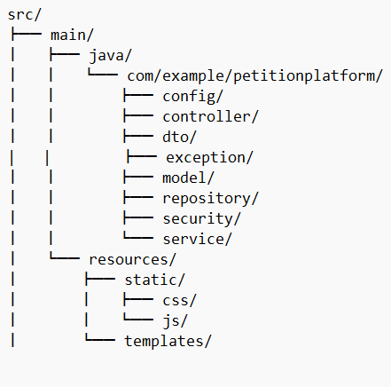

# Shangri-La Petition Platform (SLPP)

Category: Web Application
- Language: Java
- Framework: Spring Boot (Backend) with Thymeleaf + Bootstrap (Frontend)

## Project Overview
SLPP is a web-based platform designed to facilitate citizen participation in parliamentary discussions through petitions. Citizens of Shangri-La can create, sign, and track petitions on matters within the government's responsibility.

## Features
- User Authentication (Petitioners & Committee)
- Petition Management
- Signature Tracking
- Committee Dashboard with Data Visualization
- Open Data REST API
- Data Export Functionality
- Interactive Word Cloud for Topic Analysis

## Technologies Used
- Backend: Java Spring Boot
- Frontend: HTML, CSS, JavaScript
- Database: MySQL
- Authentication: JWT
- Visualization: Chart.js, D3.js
- PDF/Excel Export: Apache POI, iText

## Prerequisites
- Java JDK 17
- Maven
- MySQL Database
- Modern Web Browser

## Installation and Setup
1. Clone the repository:

        git clone [repository-url]

        cd petition-platform

2. Configure Database:

Edit src/main/resources/application.properties:

    spring.datasource.url=jdbc:mysql://localhost:3306/yourdatabase
    spring.datasource.username=your_username
    spring.datasource.password=your_password

3. Build the project:
   
        mvn clean install
4. Run the application:
   
        mvn spring-boot:run
5. Access the application:

        Open browser and navigate to  http://localhost:8080

## **User Types and Access**

### Regular Petitioners

* Can register and login
* Create new petitions
* Sign existing petitions
* View petition status and responses

## Committee Members

* Pre-defined admin account:

  * Email: admin@petition.parliament.sr
  * Password: 2025%shangrila
  

* Set signature thresholds
* View petition details
* Respond to petitions that meet threshold

## REST API Endpoints

### Open Data API

1. Get All Petitions:

        GET /slpp/petitions
2. Get Open Petitions:
   
        GET /slpp/petitions?status=open
3. Get Open Petitions:

       GET /slpp/petitions?status=open

## Additional Features

### Data Export

* Excel Export
* PDF Export
* Customizable Reports

### Data Visualization

* Petition Status Distribution
* Signature Trends
* Topic Word Cloud
* Interactive Charts

# Project Structure

# Security Features

* JWT Authentication
* Password Encryption
* Role-Based Access Control
* BioID Validation

# Error Handling

* Custom Exception Handling
* User-Friendly Error Messages
* Input Validation

# Browser Compatibility

* Chrome (recommended)
* Firefox
* Safari
* Edge

# **Contributing**
This is a coursework project and is not open for contributions.

### Authors

**[ABDULLAHI ABDULLATEEF]**

### Acknowledgments

* University of Leicester
* Module CO3102

### **License**

This project is created for educational purposes as part of my university coursework.